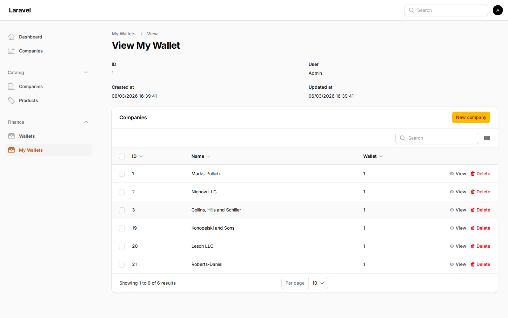
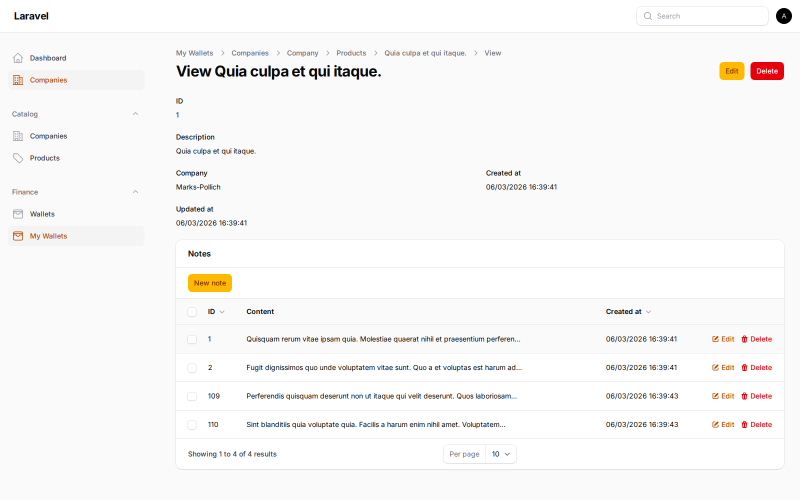

# Filament Single Record Resource

[](https://packagist.org/packages/coringawc/filament-single-record-resource)
[](https://github.com/coringawc/filament-single-record-resource/actions?query=workflow%3Arun-tests+branch%3A5.x)
[](https://github.com/coringawc/filament-single-record-resource/actions?query=workflow%3A%22Fix+PHP+code+styling%22+branch%3A5.x)
[](https://packagist.org/packages/coringawc/filament-single-record-resource)

This package implements the single-record resource pattern for Filament panels.

Instead of a list page (`index`) with many records, you open one resource that always resolves to one business record per authenticated user.

Common examples:

- My Profile
- My Wallet
- My Settings
- Current Subscription

## Compatibility

- Filament `^4.0 || ^5.0`
- Laravel versions supported by the selected Filament major

## Installation

```bash
composer require coringawc/filament-single-record-resource
```

## Core Concepts

This package is based on two traits:

It also exposes an explicit contract interface, `SingleRecordResolvableResource`, for Resources that want first-class static-analysis support.

1. `HasSingleRecordResource` (Resource trait)

- Redirects index/navigation behavior to `view`
- Keeps sidebar navigation working without an `index` page
- Falls back to `view` authorization on the resolved record when `viewAny` is denied
- Exposes shared record resolution hooks on the Resource
- Helps nested resources resolve root URLs/slugs in single-record chains

2. `HasSingleRecord` (Page trait for `ViewRecord` and `EditRecord`)

- Resolves the root single record automatically
- Supports custom resolution via builder or custom resolver method
- Prefers the Resource contract when available, while remaining compatible with legacy Resources that expose the same methods manually
- Normalizes breadcrumbs in deep nested resources

## Step-by-Step Implementation

### 1. Create your resource as single-record root

In your Filament Resource, use `HasSingleRecordResource` and register only `view` (and optionally `edit`) pages.

```php
<?php

namespace App\Filament\Resources\MyWallets;

use App\Filament\Resources\MyWallets\Pages\EditMyWallet;
use App\Filament\Resources\MyWallets\Pages\ViewMyWallet;
use CoringaWc\FilamentSingleRecordResource\Contracts\SingleRecordResolvableResource;
use CoringaWc\FilamentSingleRecordResource\Traits\HasSingleRecordResource;
use Filament\Resources\Resource;

class MyWalletResource extends Resource implements SingleRecordResolvableResource
{
    use HasSingleRecordResource;

    public static function getPages(): array
    {
        return [
            'view' => ViewMyWallet::route('/'),
            'edit' => EditMyWallet::route('/edit'),
        ];
    }
}
```

### 2. Use `HasSingleRecord` in `ViewRecord`

```php
<?php

namespace App\Filament\Resources\MyWallets\Pages;

use App\Filament\Resources\MyWallets\MyWalletResource;
use CoringaWc\FilamentSingleRecordResource\Traits\HasSingleRecord;
use Filament\Resources\Pages\ViewRecord;

class ViewMyWallet extends ViewRecord
{
    use HasSingleRecord;

    protected static string $resource = MyWalletResource::class;
}
```

### 3. Optional: also use `HasSingleRecord` in `EditRecord`

Yes, this package supports `EditRecord` too.

```php
<?php

namespace App\Filament\Resources\MyWallets\Pages;

use App\Filament\Resources\MyWallets\MyWalletResource;
use CoringaWc\FilamentSingleRecordResource\Traits\HasSingleRecord;
use Filament\Resources\Pages\EditRecord;

class EditMyWallet extends EditRecord
{
    use HasSingleRecord;

    protected static string $resource = MyWalletResource::class;
}
```

## Automatic Record Resolution (1:1 with authenticated user)

By default, `HasSingleRecord` calls a builder that applies `whereBelongsTo(Filament::auth()->user())`.

In practice, this works automatically when your resource model has a `belongsTo(User::class)` relation that points to the authenticated Filament user.

Typical 1:1 setup:

- `User hasOne Wallet`
- `Wallet belongsTo User`

Example model relationships:

```php
// App\Models\User
public function wallet(): HasOne
{
    return $this->hasOne(Wallet::class);
}

// App\Models\Wallet
public function user(): BelongsTo
{
    return $this->belongsTo(User::class);
}
```

With this, your single-record root page resolves the wallet for the logged-in user automatically.

For explicit static-analysis support, implement `SingleRecordResolvableResource` on Resources using `HasSingleRecordResource`. The package still accepts legacy Resources that define the same methods manually, but the interface is now the recommended public contract.

## Authorization Behavior

Filament normally uses `viewAny()` to decide whether a Resource can register navigation and be accessed at the Resource level.

For a root single-record resource, that default is too strict because there is no collection UX. This package now treats the Resource as accessible when:

- `viewAny()` is allowed, or
- `viewAny()` is denied but `view()` is allowed for the resolved single record

This means a policy can intentionally deny listing while still allowing the user to open their own single record.

## Custom Resolution Strategies

If your rule is not a simple `belongsTo(user)`, prefer overriding one of the methods below on the Resource so authorization and page loading stay aligned.

### A) Customize builder on the Resource (`resolveSingleRecordBuilder`)

```php
public static function resolveSingleRecordBuilder(Builder $query): Builder
{
    return parent::resolveSingleRecordBuilder($query)
        ->where('active', true);
}
```

### B) Full custom resolver on the Resource (`resolveSingleRecord`)

Use this when you need `firstOrCreate`, tenant logic, or complex business rules.

```php
public static function resolveSingleRecord(): ?Model
{
    /** @var \App\Models\User|null $user */
    $user = filament()->auth()->user();

    if ($user === null) {
        return null;
    }

    return $user->wallet()->firstOrCreate([]);
}
```

### C) Optional page-specific override

If a specific `ViewRecord`/`EditRecord` page truly needs different resolution behavior than the Resource, you can still override the page methods:

```php
protected function resolveSingleRecordBuilder(Builder $query): Builder
{
    return parent::resolveSingleRecordBuilder($query)
        ->where('active', true);
}
```

## Nested Resources

For nested chains (for example `MyWallet -> Companies -> Products`):

1. Keep `HasSingleRecordResource` on resources that follow the single-record flow
2. Keep `HasSingleRecord` in deep `ViewRecord`/`EditRecord` pages
3. If removing parent IDs from URLs, enforce strict query scoping in your models/pages
4. Prefer implementing `SingleRecordResolvableResource` on Resources using `HasSingleRecordResource` so static analysis can understand the contract explicitly

This package also helps preserve breadcrumb consistency in deep nested routes.

## Screenshots

### MyWallet (Root Single Resource)



### Deep Nested Resource (MyWallet -> Companies -> Products)



## Testing

Run tests:

```bash
composer test
```

The package CI validates the plugin in two scenarios:

- Filament 4 latest stable in major
- Filament 5 latest stable in major

## Changelog

Please see [CHANGELOG](CHANGELOG.md) for details.

## Contributing

Please see [CONTRIBUTING](.github/CONTRIBUTING.md).

## Security

Please review [our security policy](.github/SECURITY.md).

## Credits

- [Argemiro Dias](https://github.com/CoringaWc)
- [All Contributors](../../contributors)

## License

The MIT License (MIT). See [LICENSE.md](LICENSE.md).
